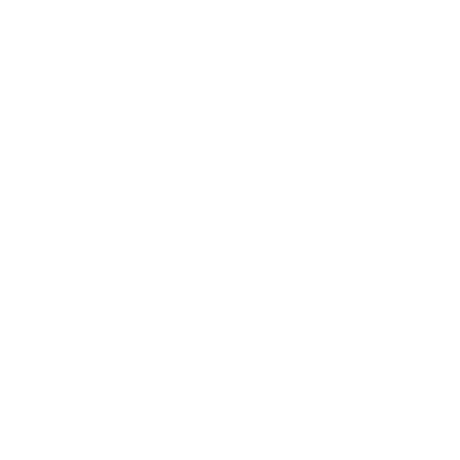
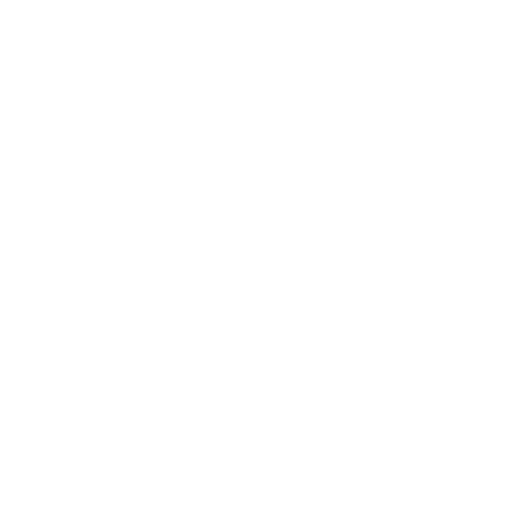
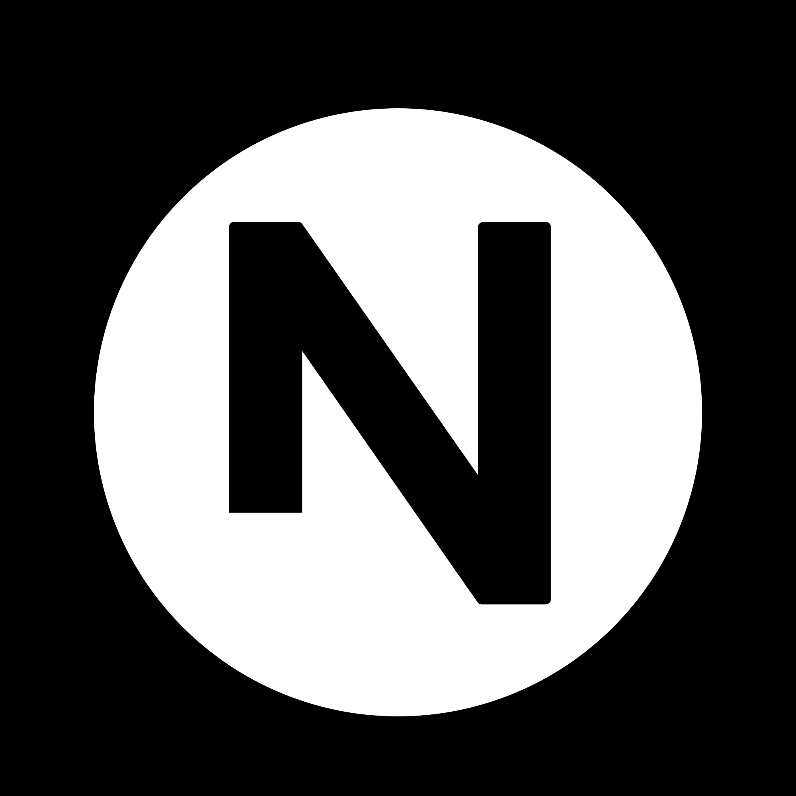
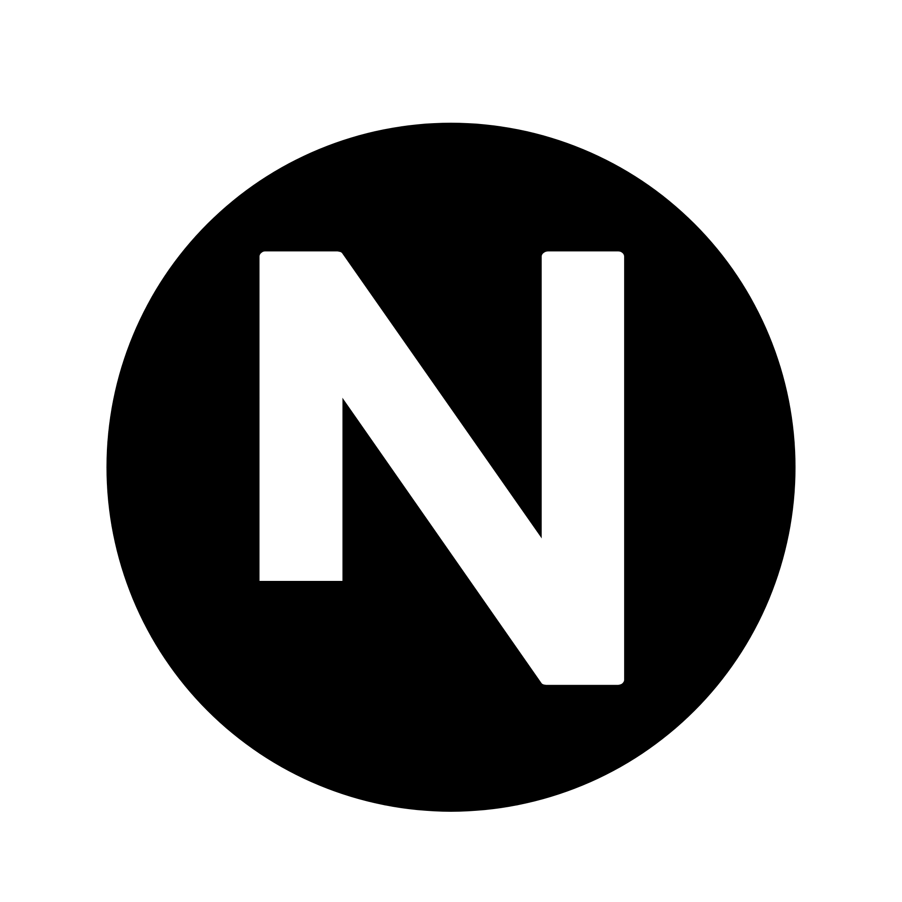

# Nanoo Logo History

## Overview

The Nanoo logo represent visual identity of Nanoo. It has evolved from a simple mobile design into a clean, professional vector mark used in modern web projects.

## Visual Gallery

Because the **Dark Mode** logo are white (#FFFFFF), they might look invisible on light background. Use the table below to preview them correctly.

| Version                | Light Background (Dark Logo)                      | Dark Background (Light Logo)                                                                                                   |
| :--------------------- | :------------------------------------------------ | :----------------------------------------------------------------------------------------------------------------------------- |
| **v.1.5.0**            |  | 

 |
| **v.1.4.2**            |  | 

 |
| **v.1.2.0**            |  | 

 |
| **v.0.0.1** (Archived) |  | 

                                     |

## Brand Evolution

The logo started as a draft created in PixelLab. Later, we move design to Inkscape to create high quality vector file. This change ensure that the logo looks sharp at any size.

We also updated the typography over time, moving from early fonts to the current **Geist** font to match a modern and simple.

## Changelog

| Version     | Date         | Description                                                    |
| :---------- | :----------- | :------------------------------------------------------------- |
| **v.1.5.0** | May 20, 2026 | Switched font to **Geist**. Final path optimization.           |
| **v.1.4.2** | May 18, 2026 | Minor path adjustments and metadata cleanup.                   |
| **v.1.2.0** | May 08, 2026 | First pure vector version using **Adwaita Sans** font (Move to Inkscape).         |
| **v.0.0.1** | Mar 08, 2026 | **[Archived]** Initial draft. Converted from PixelLab (PNG) to Inkscape SVG. |

---

**Author:** Adnan Slamet Wibowo (Nanoolabs)  
**Official URL:** [nanoolabs.dev](https://nanoolabs.dev)
