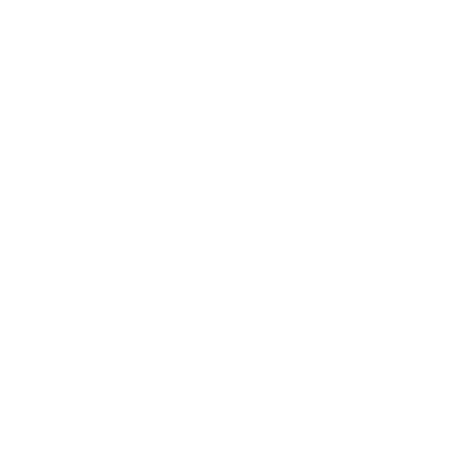
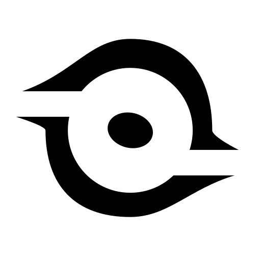

# Nanoo Logo History

## Overview

The Nanoo logo represents the visual identity of Nanoo. It has evolved from a simple mobile design into a clean, professional vector mark used in modern web projects.

## Visual Gallery

Because the **Dark Mode** logos are white (`#FFFFFF`), they might look invisible on a light background. Use the table below to preview them correctly.

| Version                  | Light Background (Dark Logo)                                                | Dark Background (Light Logo)                                                                                                                            |
| :----------------------- | :-------------------------------------------------------------------------- | :------------------------------------------------------------------------------------------------------------------------------------------------------ |
| **v.2.1.1**              |              | 

           |
| **v.2.1.0** _(Archived)_ |  | 

 |
| **v.2.0.0** _(Archived)_ |  | 

 |
| **v.1.5.0** _(Archived)_ |  | 

 |
| **v.1.4.2** _(Archived)_ |  | 

 |
| **v.1.2.0** _(Archived)_ |  | 

 |
| **v.0.0.1** _(Archived)_ |  | 

 |

## Brand Evolution

The logo started as a draft created in PixelLab. Later, we moved the design to Inkscape to create a high-quality vector file. This change ensures that the logo looks sharp at any size.

We also updated the typography over time, moving from early fonts to the current **Geist** font to match a modern and simple aesthetic.

## Changelog

| Version     | Date          | Description                                                                                                                 |
| :---------- | :------------ | :-------------------------------------------------------------------------------------------------------------------------- |
| **v.2.1.1** | July 08, 2026 | Merged light/dark variants into one theme-aware SVG via `prefers-color-scheme`. Single file for favicon & universal use.    |
| **v.2.1.0** | June 28, 2026 | **[Archived]** Optimized geometry using Boolean difference (`Ctrl` + `-`) to a true single path transparent vector cut out. |
| **v.2.0.0** | June 27, 2026 | **[Archived]** Revamp Nanoo Logo. Inspired by a black hole to represent the letter "O/o".                                   |
| **v.1.5.0** | May 20, 2026  | **[Archived]** Switched font to **Geist**. Final path optimization.                                                         |
| **v.1.4.2** | May 18, 2026  | **[Archived]** Minor path adjustments and metadata cleanup.                                                                 |
| **v.1.2.0** | May 08, 2026  | **[Archived]** First pure vector version using **Adwaita Sans** font (Moved to Inkscape).                                   |
| **v.0.0.1** | Mar 08, 2026  | **[Archived]** Initial draft. Converted from PixelLab (PNG) to Inkscape SVG.                                                |

---

**Author:** Adnan Slamet Wibowo (nanoolabs)
**Official URL:** [nanoolabs.dev](https://nanoolabs.dev)
